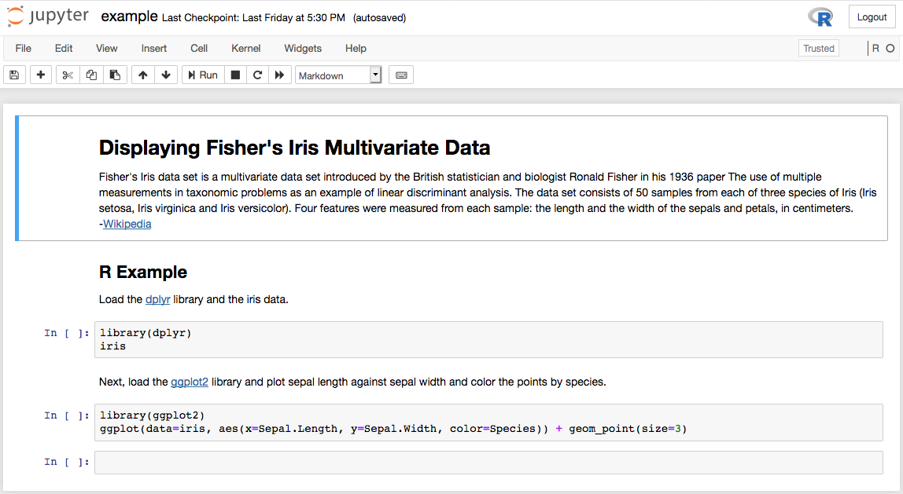

# Linux

## Constructor File

The constructor file specifies a number of keys:

```
install_in_dependency_order: True 
installer_filename: conda-R.sh 
initialize_by_default: True 
installer_type: sh  [linux] 
license_file: ../EULA.txt
```
Note that the conda environment is initialized in install, this means that installing it will overwrite the conda initialization script if Anconda or Miniconda are installed.

## Building the Installer

In the terminal:
```
(base) $ cd ~/<path-to-repo>/condaR/linux
(base) $ constructor .
```
The installer will be written to the working directory
## Installing and Starting

To install
```
$ sh conda-R.sh
```
To initialize conda-R, reload .bash_profile
```
$ source ~/.bashrc
(base) $
```
## Running R in Jupyter Notebook
To run the example notebook:
```
(base) $ jupyter notebook ~/path-to-repo/condaR/example.ipynb
```
The notebook will open in a browser.

